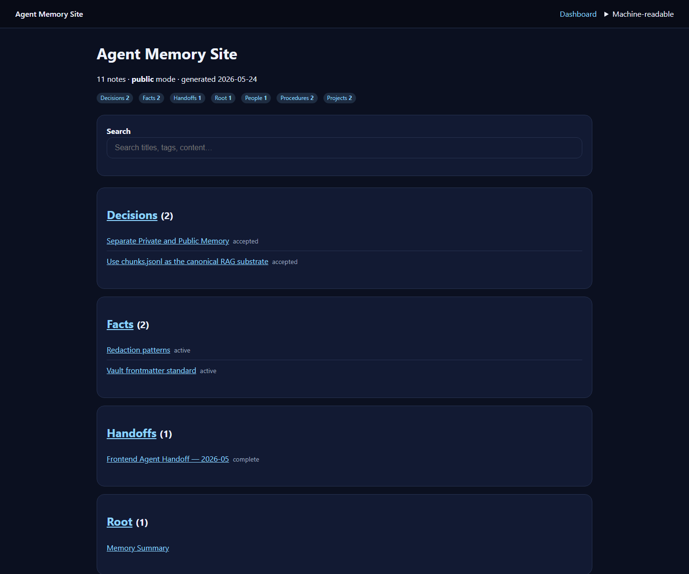
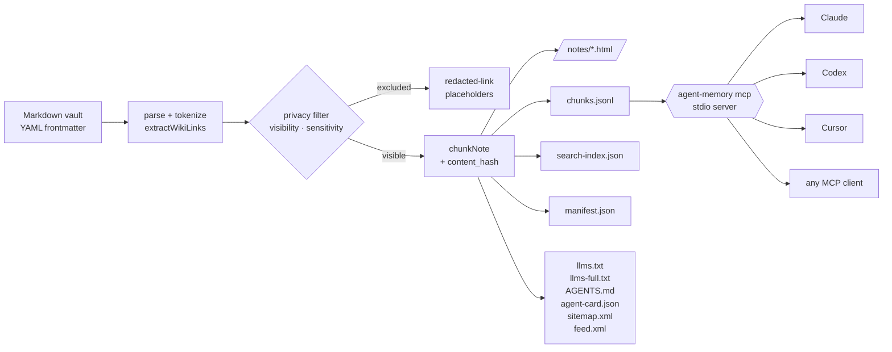
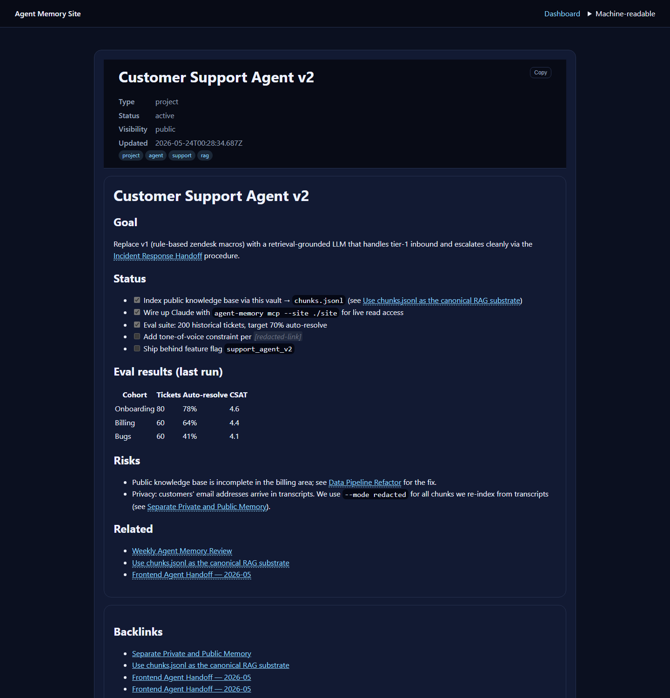

# Agent Memory Site

**Compile your Markdown vault into a portable agent memory. One build, every agent: Claude, Codex, Cursor, MCP, llms.txt.**

> The Pandoc of agent memory — Markdown is the database, semantic HTML is the human interface, JSONL is the retrieval layer, MCP is the runtime.

[](https://github.com/nikopastore/agent-memory-site/actions/workflows/ci.yml)
[](LICENSE)
[](https://www.typescriptlang.org/)
[](package.json)

`agent-memory-site` is a local-first CLI that turns a directory of Markdown notes into:

1. A **private, browsable dashboard** with real client-side search.
2. **Retrieval-ready JSONL chunks** with stable IDs, content hashes, and provenance — ready for any RAG pipeline.
3. **A live MCP server** any agent can attach to (Claude Desktop, Claude Code, Codex CLI, Cursor, Continue, …).
4. **All the agent-context files at once**: `AGENTS.md`, `CLAUDE.md`, `.cursorrules`, `copilot-instructions.md`, `llms.txt`, `llms-full.txt`, `/.well-known/agent-card.json`, plus `sitemap.xml` + `feed.xml`.

No service to sign up for. No editor lock-in. No competing format. The vault is just Markdown.



## Architecture



One parse pass. One privacy pass. One emit pass. Every agent reads the same artifacts.

## The 90-second demo

```bash
npx agent-memory-site init ./memory
npx agent-memory-site build --source ./memory --out ./site --mode private
claude mcp add agent-memory "npx agent-memory-site mcp --site ./site"
```

Now Claude knows everything in your notes. Same bundle works for Codex (`codex mcp add ...`), Cursor (`.cursor/mcp.json`), and any other MCP client. Local-first, privacy-aware, no service to sign up for.

## Why it exists

Markdown is the best source format for humans and Git: easy to write, diff, review, and edit with AI. But every agent reads it differently. So you end up writing the same context three times — once for `AGENTS.md`, once for `CLAUDE.md`, once for `.cursorrules` — and your RAG pipeline still doesn't know about any of it.

`agent-memory-site` solves the duplication. **One vault → one build → every agent reads the same thing.**

## What it does (and doesn't) compete with

| Tool | What it does | What it's missing for agent memory |
|---|---|---|
| **[Quartz](https://quartz.jzhao.xyz/)**, **[Obsidian Digital Garden](https://github.com/oleeskild/obsidian-digital-garden)** | Publish a Markdown vault as a beautiful site **for humans** | No JSONL retrieval, no MCP, no privacy modes, no agent-context fan-out |
| **Obsidian Publish**, **[Mintlify](https://mintlify.com/)** | Hosted SaaS publishing | Closed, paid; per-vault lock-in; not agent-portable |
| **[Letta](https://docs.letta.com/) / [MemGPT](https://github.com/cpacker/MemGPT) / [Mem0](https://mem0.ai/)** | Agent memory frameworks with their own schemas | Heavyweight runtimes; format-locked; no human-readable export |
| **[MCPVault](https://medium.com/@ai_transfer_lab/mcpvault-...)**, **[mcp-memory-service](https://github.com/doobidoo/mcp-memory-service)** | Live MCP server over a vault | Editor / computer must be running; not portable; can't hand off the bundle |
| **agent-memory-site** | Compiles vault → HTML + JSONL + MCP + AGENTS.md + llms.txt | _is this thing_ |

If you want **live editing in Obsidian piped into Claude**, use MCPVault. If you want **a single bundle you can ship, share, snapshot, and feed every agent**, use this.

## Use cases

| Scenario | What this gives you |
|---|---|
| **AI agent handoff memory** | Every session ends with a handoff note in `handoffs/`. Next session, the agent reads them via MCP and picks up cleanly. |
| **Team agent operating system** | One shared vault. Every agent (yours + your teammates') reads the same `chunks.jsonl`. No format drift. |
| **Obsidian Publish alternative** | Publish your vault publicly without paying $10/mo, and pick up agent-context files for free. |
| **Private team dashboard** | `--mode private` build, serve on the LAN or behind SSO. No SaaS. No telemetry. |
| **Retrieval substrate for a custom agent** | Drop `chunks.jsonl` into LangChain / LlamaIndex / Mem0 / Letta. Each chunk carries `content_hash` so your embedding cache survives note edits to unrelated chunks. |
| **Public sanitized project logs** | `--mode redacted` + per-note `redact:` deny-list. Push to GitHub Pages without leaking codenames. |
| **Agent audit trail** | The HTML pages keep provenance. "Where did the agent get that answer?" → click through to the source note. |
| **AI context portable across tools** | One build → AGENTS.md (Codex/Aider) + CLAUDE.md + .cursorrules + .github/copilot-instructions.md + llms.txt. Write once, every editor sees the same instructions. |

## The bigger picture

AI agents are starting to accumulate durable memory. Most of it is trapped in messy Markdown files, Obsidian vaults, chat exports, and hidden local folders. That memory is hard to inspect, hard to share safely, hard to audit, hard to turn into retrieval, and hard to hand off between tools.

`agent-memory-site` is the **compile step** between that mess and your agents. Markdown stays the source of truth — humans and AI both write it fluently — but every agent ends up reading a clean, privacy-filtered, retrieval-ready bundle.

This repo is the first of a family. Roadmap:

- `agent-memory-lint` — validate memory quality + flag stale notes + catch unmarked secrets
- `agent-memory-sync` — sync sections across tools (Obsidian ↔ Notion ↔ Linear)
- `agent-memory-template` — `Use this template` GitHub repo with a starter vault wired to Pages
- `agent-memory-bench` — eval memory usefulness (retrieval precision over a question bank)

## Install

```bash
npm install -g agent-memory-site
# or run without installing:
npx agent-memory-site --help
```

Requires Node 20+. Pure local — no telemetry, no network calls, no `postinstall` scripts.

## Commands at a glance

```text
agent-memory init [dir]                       # scaffold a starter vault
agent-memory new <type> <title> [--source]    # scaffold a single note
agent-memory build --source --out --mode      # compile vault → site
agent-memory serve --out [--port] [--no-open] # local HTTP on 127.0.0.1
agent-memory validate --source [--json] [--strict]
agent-memory publish-check --source --out     # pre-publish gate
agent-memory stats --source                   # counts + health
agent-memory emit --target <target...> --source --out
agent-memory mcp --site <dir>                 # run as MCP server (stdio)
```

Every command prints a "Next steps" hint block. Every command works on Windows, macOS, and Linux.

### `agent-memory build`

```bash
agent-memory build --source ./memory --out ./site --mode private
```

Modes:

- `private` — include all parsed notes (default).
- `public` — exclude `visibility: private|team` and `sensitivity: personal|credential|financial|medical`.
- `redacted` — include the notes but redact emails, common API-key shapes, JWTs, bearer tokens.

Flags:

- `--strict-redact` — also redact phones, IPv4, credit-card-shaped digits.
- `--base-url <url>` — for canonical / OG / Twitter card tags.
- `--dry-run` — plan only; don't write files.
- `--force` — overwrite a non-empty output directory even if it lacks the `.agent-memory-output` marker.

### `agent-memory mcp` — the killer feature

```bash
agent-memory mcp --site ./site
```

Runs an MCP server over stdio that exposes a compiled site as four agent-callable tools:

- `search_memory(query, type?, tag?, limit?)`
- `get_note(id)`
- `list_recent(limit?, type?)`
- `list_categories()`

Wire it into any MCP client:

```bash
# Claude Code / Claude Desktop
claude mcp add agent-memory "agent-memory mcp --site /absolute/path/to/site"

# Codex CLI
codex mcp add agent-memory --command "agent-memory" --args "mcp --site /absolute/path/to/site"

# Cursor — add to .cursor/mcp.json
{
  "mcpServers": {
    "agent-memory": { "command": "agent-memory", "args": ["mcp", "--site", "./site"] }
  }
}
```

### `agent-memory emit` — one vault, every format

```bash
agent-memory emit --target all --source ./memory --out .
# Writes:
#   AGENTS.md
#   CLAUDE.md
#   .cursorrules
#   .github/copilot-instructions.md
#   .windsurfrules
#   .aider.conf.yml
#   llms.txt
#   llms-full.txt
```

Or pick a subset: `--target agents.md claude.md cursorrules`.

## What `build` generates

```
site/
├── index.html                 — dashboard with live search
├── 404.html
├── favicon.svg
├── notes/<slug>.html          — one page per note, semantic HTML + backlinks
├── <category>.html            — one page per category
├── chunks.jsonl               — RAG-ready chunks with provenance
├── search-index.json          — keyword/metadata index (always redacted)
├── manifest.json              — note inventory (source paths omitted in public/redacted)
├── llms.txt                   — Anthropic-spec agent index
├── llms-full.txt              — full-text mirror
├── AGENTS.md                  — Linux-Foundation agent-context standard
├── sitemap.xml                — for crawlers and AI agents
├── feed.xml                   — RSS feed of recent notes
├── robots.txt                 — points at sitemap + llms.txt
├── .well-known/
│   └── agent-card.json        — agent capability descriptor
├── assets/
│   ├── style.css
│   ├── search.js
│   └── copy.js
└── .agent-memory-output       — safety marker for safe re-builds
```

The chunk + manifest formats are documented with JSON Schemas at [`docs/schemas/`](docs/schemas/).

Each chunk looks like:

```json
{
  "chunk_id": "projects/launch-project#goal",
  "doc_id": "projects/launch-project",
  "title": "Launch Project",
  "heading_path": ["Launch Project", "Goal"],
  "type": "project",
  "text": "Ship agent-memory-site 0.2 with a built-in MCP server …",
  "source_path": "projects/launch-project.md",
  "canonical_url": "notes/projects-launch-project.html",
  "tags": ["project", "launch"],
  "tokens": 27,
  "content_hash": "fa12d8e7c1a3",
  "visibility": "public",
  "updated": "2026-05-22T10:14:00.000Z"
}
```

## Privacy model

Every note can opt into a privacy class via frontmatter:

```yaml
---
visibility: public | private | team
sensitivity: none | personal | credential | financial | medical
redact: ['Project Codename Alpha', 'staging.internal']
---
```

The build enforces:

- Wiki-link resolution happens **after** privacy filtering. If a public note links to `[[Private Codename]]`, the link collapses to `[redacted-link]` — the title never appears.
- The search index strips emails / secret patterns regardless of build mode.
- The manifest does not ship source file paths in `public` or `redacted` modes.
- Markdown link URLs are restricted to `https?:`, `mailto:`, `tel:`, `#`, and relative paths. `javascript:` is rewritten to `#blocked`.
- Every page sets a strict `Content-Security-Policy` (no inline scripts, no `<script>` from third-party origins).

> **Redaction is best-effort, not a guarantee.** Use `agent-memory publish-check` before pushing anything public. Use an external scanner (Gitleaks / TruffleHog) for high-stakes deploys. See [SECURITY.md](SECURITY.md) for the threat model.

## Recommended vault layout

```text
memory/
  MEMORY.md             # top-level summary; every agent reads this first
  projects/             # active work
  decisions/            # decisions + reasoning
  facts/                # things an agent should never re-derive
  people/               # collaborators + context
  daily/                # daily logs / standups
  handoffs/             # session-to-session continuity
  procedures/           # repeatable workflows
```

`agent-memory init` scaffolds this structure plus a starter set of example notes (use `--bare` for the old empty behavior).

## Configuration

Drop an `agent-memory.config.json` at the project root to override defaults:

```json
{
  "title": "My Agent Memory",
  "source": "./memory",
  "out": "./site",
  "defaultMode": "private",
  "baseUrl": "https://yourname.github.io/my-memory",
  "description": "Compiled agent memory for X.",
  "redact": ["ProjectAtlas"]
}
```

## How this complements Tolaria / Obsidian

Use Tolaria, Obsidian, Logseq, or your editor of choice to write and maintain Markdown. Use agent-memory-site to compile a portable bundle every agent can read. It is not trying to replace your note editor — it's the build step between your vault and your agents.

## Cookbook

Wiring recipes for every common stack — each one is ≤ 50 lines and ships into a fresh project verbatim:

- [Claude Code (MCP)](docs/cookbook/claude-code.md)
- [Cursor (MCP)](docs/cookbook/cursor.md)
- [Codex CLI (MCP)](docs/cookbook/codex.md)
- [LangChain](docs/cookbook/langchain.md)
- [LlamaIndex](docs/cookbook/llamaindex.md)
- [Mem0](docs/cookbook/mem0.md)
- [Letta / MemGPT](docs/cookbook/letta.md)
- [OpenAI Assistants / Memory tool](docs/cookbook/openai-memory.md)
- [GitHub Action — build + deploy your vault on push](docs/cookbook/github-action.md)

## What a note page looks like



## Roadmap

- Local embeddings via `--embed` (in-process WASM by default; `--embed-provider ollama|openai|gemini` for power users)
- Adapters: `--export-to mem0 | letta | codex-memories | openai-memory`
- `agent-memory watch` — incremental rebuild + MCP hot-reload
- Starter packs gallery: `agent-memory init --template job-hunt-agent | paper-trading-bot | research-assistant`
- Graph view (cytoscape over `manifest.json`)
- VS Code / Cursor extension that auto-builds on save and points the editor's agent at the bundle

See [CHANGELOG.md](CHANGELOG.md) for what landed in 0.2.

## Contributing

Contributions welcome. Start with [CONTRIBUTING.md](CONTRIBUTING.md), run `npm run ci`, open a focused PR.

## Security

For vulnerability reports, see [SECURITY.md](SECURITY.md) or open a private security advisory.

## License

MIT. See [LICENSE](LICENSE).
