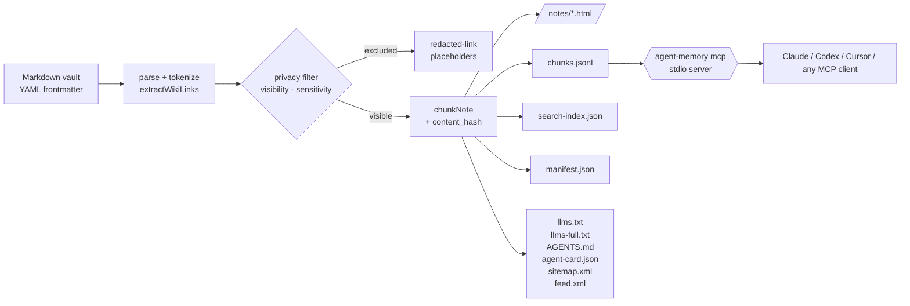

# Architecture

A single parse pass, a single privacy pass, a single emit pass. Every artifact comes from the same in-memory `Note[]`.

## Pipeline stages

### 1. Ingest — `src/ingest/markdown.ts`

- `walk()` recursively finds `*.md` / `*.qmd`.
- `parseVault()` reads each file concurrently via `Promise.all`.
- `matter()` extracts YAML frontmatter; parse errors include the file path.
- `escapeRawHtml()` converts `<` / `>` to entities BEFORE markdown rendering so embedded `<script>` / `` survives as visible text rather than executable HTML.
- `tokenizeWikiLinks()` replaces `[[Target]]` with opaque sentinels `@@WIKI@@<slug>::<b64-label>@@/WIKI@@`. The slug is privacy-aware later; the label is base64-encoded so common markdown-cleaning regex passes can't mangle it.
- `marked.parse()` runs with a custom renderer that allowlists link URL schemes (`https?:`, `mailto:`, `tel:`, `#`, relative) and image URL schemes (`data:image/*`). `javascript:` rewrites to `#blocked`.
- Slug-collision disambiguation: notes with the same slug get a short `content_hash` suffix.
- Backlinks computed by walking `byId` + slugified-title maps.

### 2. Privacy filter — `src/build/privacy.ts` + `src/build/site.ts`

- `includeNote(n, mode)` decides whether a note ships in this build:
  - `private` → all
  - `public` → only `visibility: public` AND `sensitivity: none`
  - `redacted` → all visibilities, but only `sensitivity: none` (others dropped entirely)
- `safeNoteForMode()` applies `redactText` to title/body/html/text/meta when in `redacted` mode.
- `redactDeep()` walks arbitrary values (strings + arrays + nested objects) so tag arrays don't slip past.
- Per-note `redact: ['literal', ...]` frontmatter is honored in every mode.

### 3. Wiki-link resolution (privacy-aware) — `src/build/site.ts`

- Build the `allowed` map from `visible` notes only: `slug → href`, `title-slug → href`, `id → href`.
- `resolveWikiTokens(html, allowed)` rewrites sentinels in HTML to `<a class="wiki-link" href="...">label</a>` for visible targets, `[redacted-link]` for hidden ones.
- `resolveWikiTokensText(text, allowed)` does the same for plain-text artifacts (chunks text, search-index text, llms-full body, meta descriptions).

### 4. Chunking — `src/build/chunks.ts`

- `splitSections()` walks line-by-line, splitting on any `#`–`######` heading.
- Hierarchical heading stack: an `h3` inside `h1 > h2 > ?` produces `heading_path = [note.title, h1, h2, h3]`. Consecutive duplicates (`[Title, Title]`) collapse.
- `cleanText()` strips heading lines, fenced + inline code, markdown punctuation.
- `forceSplit()` enforces `MAX_CHARS = 4000` per chunk to keep RAG retrieval crisp.
- Stable `chunk_id`: `<doc_id>#<heading-slug>`. Reordering source sections does NOT change chunk ids. Collisions disambiguated with `-2`, `-3`.
- `content_hash` is a short SHA-256 of the chunk text — embedding caches survive unrelated edits.

### 5. Emit — `src/build/site.ts`

| Artifact | Notes |
|---|---|
| `notes/<slug>.html` | One page per note, semantic `<article>` + `<aside>` for backlinks. Per-page CSP. Copy-as-markdown button per article. |
| `<category>.html` | One page per category. |
| `index.html` | Dashboard, real client-side fuzzy search via `assets/search.js`. |
| `404.html` | Friendly 404, same theme. |
| `chunks.jsonl` | One JSON object per line. Schema: [`docs/schemas/chunk.schema.json`](schemas/chunk.schema.json). |
| `search-index.json` | Always-redacted derived index. |
| `manifest.json` | Inventory. Source paths dropped in public/redacted modes. Schema: [`docs/schemas/manifest.schema.json`](schemas/manifest.schema.json). |
| `llms.txt` | Anthropic-spec agent index. |
| `llms-full.txt` | Full-text mirror. |
| `AGENTS.md` | Linux-Foundation cross-agent context standard. |
| `.well-known/agent-card.json` | Capability descriptor for emerging cross-vendor agent-discovery standards. |
| `sitemap.xml` + `robots.txt` | SEO + agent discovery. |
| `feed.xml` | RSS of recent notes. |
| `favicon.svg` | Inline SVG, no external request. |
| `assets/{style,search,copy}.{css,js}` | Self-contained; CSP-compatible. |
| `.agent-memory-output` | Marker file; `assertSafeOutputDir` checks for it before any `rm -rf` on subsequent builds. |

### 6. Optional MCP runtime — `src/mcp/server.ts`

- `agent-memory mcp --site ./site` runs an MCP server over stdio.
- Loads `chunks.jsonl` + `manifest.json` once at startup.
- Exposes four tools: `search_memory`, `get_note`, `list_recent`, `list_categories`.
- No network calls. No state beyond the loaded bundle. Restart on rebuild (a watch mode is planned for 0.4).
